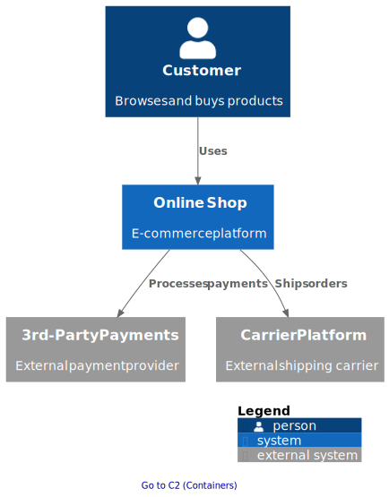

# C4 Model Landscape

This repository contains shared C4 Model landscape diagrams for the Orders, Payment, and Delivery microservices.

Available here:
- C4 Model System Context (Level 1): `c4/c4-system-context.puml` (renders to `c4/c4-system-context.svg`)
- C4 Model Container (Level 2): `c4/c4-containers.puml` (renders to `c4/c4-containers.svg`)

C4 Model Component (Level 3) diagrams live in each individual service repository and are only linked from the C4 Model Container diagram via external GitHub Pages URLs. 
They are not present as files in this repo, so paths have been omitted intentionally.

## Example (Level 1 System Context)
Inline preview of the generated SVG (clickable areas preserved when viewed on GitHub Pages):



## Navigation
- The PUML sources embed links; after rendering to SVG the links become clickable.
- GitHub Actions workflow (`.github/workflows/diagrams.yml`) automatically renders the PUML files and publishes the SVGs to GitHub Pages.

## Generate locally
- Run `./generate.sh` to render updated SVGs (requires `plantuml` in PATH).

## Manual Rendering Without Script
You can bypass `generate.sh`:
```bash
plantuml -tsvg c4/*.puml
```
This produces identical SVGs.

## Repository Structure (relevant parts)
- `c4/` — Level 1 and Level 2 PUML sources and generated SVGs
- `styles/` — shared PlantUML style snippets (`style.puml`)
- `examples/` — example usage (`test-style.puml`)
- `generate.sh` — helper script to render diagrams
- `.github/workflows/diagrams.yml` — CI workflow to build & publish diagrams

---
Maintainers: update this README if the workflow file name or publishing mechanism changes.
